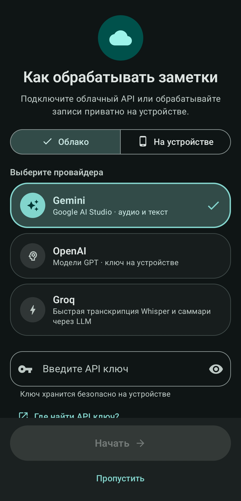
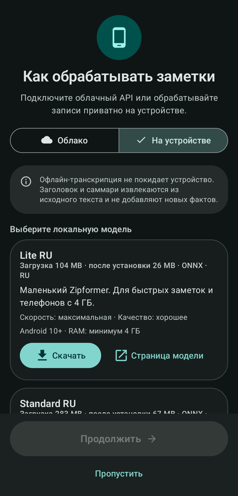
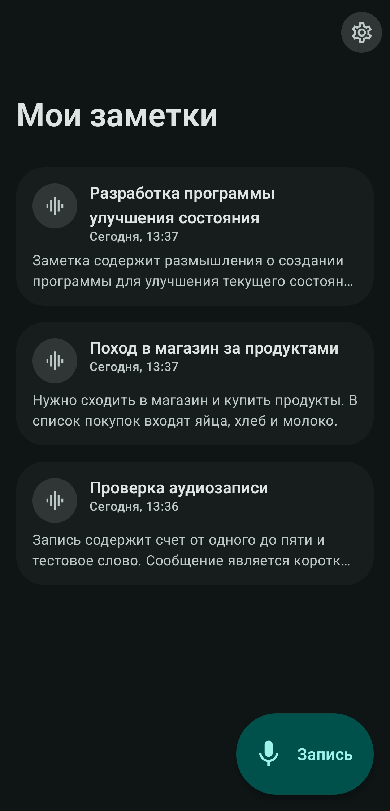
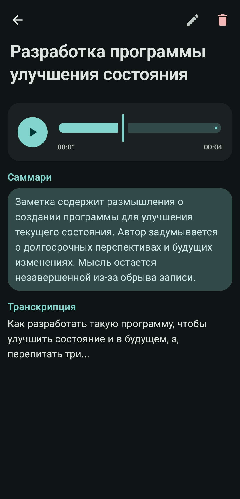
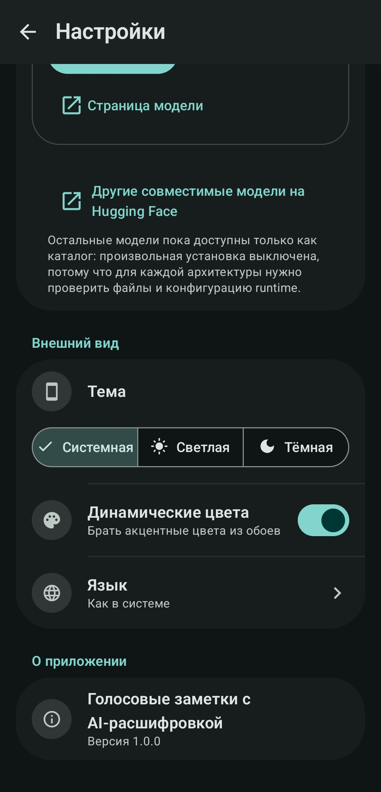
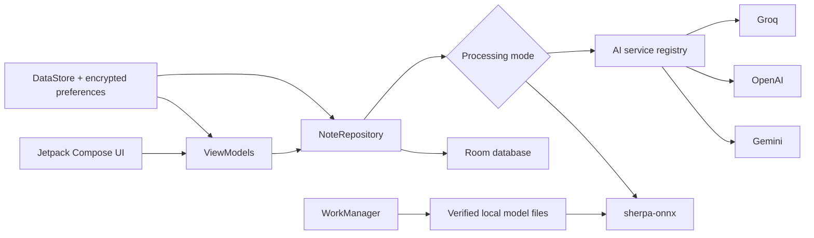

# VoiceNotes

[](https://github.com/Akbar02Work/VoiceNotes/actions/workflows/android.yml)
[](https://kotlinlang.org/)
[](https://developer.android.com/)
[](LICENSE)

VoiceNotes is a native Android app that turns short recordings into searchable notes with a
transcription, title, summary, and playable audio. Processing can use Gemini, OpenAI, Groq, or a
fully on-device Russian speech-to-text model.

The project focuses on a polished recording flow, recoverable failure states, secure bring-your-own
key storage, and offline inference that does not treat arbitrary model files as interchangeable.

## Screenshots

<table>
  <tr>
    <th>Cloud setup</th>
    <th>On-device setup</th>
  </tr>
  <tr>
    <td></td>
    <td></td>
  </tr>
</table>

<table>
  <tr>
    <th>Notes list</th>
    <th>Note details and playback</th>
    <th>Settings</th>
  </tr>
  <tr>
    <td></td>
    <td></td>
    <td></td>
  </tr>
</table>

## Highlights

- One-tap AAC recording with clear recording, processing, draft, failure, and retry states
- AI transcription plus generated titles and summaries
- Gemini, OpenAI, and Groq with API-key validation and compatible model discovery
- Russian offline speech-to-text powered by sherpa-onnx and INT8 Zipformer models
- Resumable model downloads with size checks, SHA-256 verification, and atomic activation
- Persistent Room storage with pinned notes and playable original audio
- API keys stored with Android encrypted preferences and excluded from backup
- English and Russian localization
- Material 3 UI with dynamic color and light, dark, and system themes

## Processing modes

| Mode | Transcription | Title and summary | Network |
| --- | --- | --- | --- |
| Gemini | Multimodal `generateContent` | Gemini model selected by the user | Required |
| OpenAI | Audio transcription endpoint | Chat completions | Required |
| Groq | OpenAI-compatible Whisper | OpenAI-compatible chat | Required |
| On device | sherpa-onnx Zipformer | Extractive local processing | Not required after download |

Cloud mode uses a bring-your-own-key model. VoiceNotes validates the key, discovers compatible
models, and stores the selected transcription and summary models separately.

On-device mode keeps recordings and transcription on the phone. Its first release intentionally
uses extractive titles and summaries: it reuses content from the transcript instead of running a
local generative language model.

## Offline models

VoiceNotes exposes two verified Russian model profiles:

| Profile | Download | Installed | Minimum device | Intended use |
| --- | ---: | ---: | --- | --- |
| Lite RU | 104 MB | 26 MB | Android 10, arm64, 4 GB RAM | Short notes and fastest processing |
| Standard RU | 283 MB | 67 MB | Android 10, arm64, 6 GB RAM | Better recognition quality |

The app downloads immutable sherpa-onnx release archives, verifies the archive checksum, extracts
only the required INT8 files, verifies every extracted file, and activates the model only after all
checks pass.

## Architecture



The codebase uses MVVM, a repository boundary, Hilt dependency injection, Flow-based state, and one
shared AI service contract for cloud providers. Offline inference remains a separate local strategy.

## Tech stack

- Kotlin 2 and Coroutines
- Jetpack Compose and Material 3
- Hilt
- Room
- DataStore and EncryptedSharedPreferences
- Retrofit, OkHttp, and Kotlin Serialization
- WorkManager
- sherpa-onnx and ONNX Zipformer models
- JUnit, MockK, Turbine, Compose UI Test, and Android instrumentation tests

## Privacy and storage

- API keys are encrypted with an Android Keystore-backed master key.
- If secure storage is unavailable, VoiceNotes refuses to persist the key instead of falling back
  to plaintext.
- API-key preferences are excluded from cloud backup and device transfer.
- Recordings are stored in the app's persistent private files directory and are deleted with their
  note, not by an age-based cache cleanup.
- Cloud mode sends audio and transcript content only to the provider selected by the user.
- On-device mode does not require an API key or network access after its model is installed.

## Build

### Requirements

- Android Studio with Android SDK 35
- JDK 17
- An arm64 Android device or emulator

```bash
git clone https://github.com/Akbar02Work/VoiceNotes.git
cd VoiceNotes
./gradlew assembleDebug
```

The debug APK is written to:

```text
app/build/outputs/apk/debug/app-debug.apk
```

## Tests

Run unit tests, lint, and a debug build:

```bash
./gradlew testDebugUnitTest lintDebug assembleDebug
```

Run Android instrumentation tests with an arm64 device or emulator connected:

```bash
./gradlew connectedDebugAndroidTest
```

The test suite covers provider routing, model discovery, offline text processing, archive
verification, repository retry behavior, localized dates, persistent recording storage, database
migration, and Activity recreation.

## Project structure

```text
app/src/main/java/com/example/voicenotes/
├── ai/          Cloud providers, offline inference, model catalog and installation
├── data/        Room entities, DAO, repository and preferences
├── di/          Hilt providers
├── network/     Retrofit APIs and transport models
├── navigation/  Compose destinations
├── ui/          Setup, settings, note details and offline model UI
├── ui/theme/    Color, type, shape, spacing and motion tokens
└── util/        Audio playback, storage, dates, errors and connectivity
```

## Current scope

- Offline recognition currently targets Russian.
- Offline titles and summaries are extractive rather than generative.
- Cloud transcription requires the user's own provider key and may incur provider charges.
- The project ships an arm64 build because the bundled native inference runtime targets arm64.

## License

VoiceNotes is available under the [MIT License](LICENSE).

## Author

Built by [Akbar02Work](https://github.com/Akbar02Work) as a portfolio-focused Android project.
